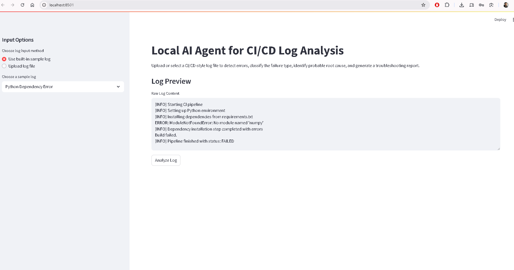

# Local AI Agent for CI/CD Log Analysis and Root Cause Recommendation

A local Streamlit-based troubleshooting assistant for analyzing CI/CD-style log files.  
The application detects important error lines, classifies the failure type, explains the probable root cause, suggests fixes, and generates a downloadable troubleshooting report.

## Project Purpose

This project was created as a portfolio project to demonstrate the connection between:

- CI/CD pipeline troubleshooting
- Python-based log parsing
- Rule-based error classification
- Root cause recommendation
- Streamlit application development
- Modular project structure

The project uses realistic sample CI/CD logs because no real company pipeline logs are included.

## Important Note

This is a local rule-based AI-agent-style tool.  
It does not use real company logs, paid cloud services, or external AI APIs in Version 1.

Version 1 started with rule-based single-category classification.  
The current version also supports multi-category detection with primary and secondary error categories.

## Features

- Upload `.log` or `.txt` files
- Use built-in sample CI/CD log files
- Extract important error lines containing keywords such as:
  - ERROR
  - FAILED
  - Exception
  - Traceback
  - Permission denied
  - ModuleNotFoundError
  - SyntaxError
  - Timeout
  - Build failed
  - Deployment failed
- Classify failures into categories:
  - Dependency Error
  - Test Failure
  - Docker Build Error
  - YAML Syntax Error
  - Permission Error
  - Timeout Error
  - Deployment Error
  - Unknown Error
- Generate:
  - probable root cause
  - suggested fix
  - confidence level
  - final troubleshooting summary
- Download report as:
  - `.txt`
  - `.csv`
  - Detect multiple related failure categories from the same log
  - Identify one primary/root category and show secondary categories
  - Assign severity levels such as High, Medium, or Low based on the primary failure category
  - Maintain an analysis history table during the current Streamlit session

## Project Structure

```text
ai-log-analyzer-agent/
│
├── app.py
├── requirements.txt
├── README.md
│
├── sample_logs/
│   ├── python_dependency_error.log
│   ├── test_failure.log
│   ├── docker_build_error.log
│   ├── yaml_syntax_error.log
│   ├── permission_error.log
│   └── deployment_timeout.log
│
├── src/
│   ├── log_parser.py
│   ├── error_classifier.py
│   ├── report_generator.py
│   └── sample_data.py
│
└── .github/
    └── workflows/
        └── test.yml

```
## Screenshots

### App Home


### Analysis Result



## Version 3: Context-Aware Troubleshooting Agent

The tool can optionally inspect related project context files such as:

- requirements.txt
- Dockerfile
- GitHub Actions workflow YAML

Based on the detected primary failure category, the local agent chooses which context file to inspect and generates evidence-based findings and recommendations.

Example:

If the log contains:

```text
ModuleNotFoundError: No module named 'numpy'
